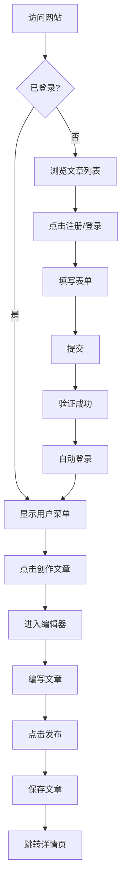

## 1. 产品概述

这是一个支持用户注册登录并创作文章的现代化内容创作平台。用户可以注册账号、登录系统，然后撰写、编辑和发布个人文章。

- **主要目的**: 为用户提供一个简洁优雅的文章创作和分享平台
- **目标用户**: 内容创作者、博主、写作者
- **核心价值**: 提供流畅的写作体验，支持文章的创建、编辑和管理

## 2. 核心功能

### 2.1 用户角色

| 角色 | 注册方式 | 核心权限 |
|------|----------|----------|
| 普通用户 | 用户名/邮箱注册 | 浏览文章、创建文章、编辑自己的文章 |
| 访客 | 无需注册 | 浏览公开文章 |

### 2.2 功能模块

1. **首页**: 展示文章列表、导航栏、用户状态
2. **登录页**: 用户登录表单
3. **注册页**: 用户注册表单
4. **文章创作页**: 富文本编辑器、文章发布
5. **文章详情页**: 文章内容展示、作者信息
6. **个人中心**: 用户信息、文章管理

### 2.3 页面详情

| 页面名称 | 模块名称 | 功能描述 |
|---------|---------|---------|
| 首页 | 导航栏 | Logo、导航链接、登录/注册按钮、用户头像下拉菜单 |
| 首页 | 文章列表 | 分页展示所有文章，包含标题、摘要、作者、发布时间 |
| 首页 | 搜索栏 | 按标题或内容搜索文章 |
| 登录页 | 登录表单 | 用户名/邮箱、密码输入，登录按钮，跳转注册链接 |
| 注册页 | 注册表单 | 用户名、邮箱、密码、确认密码输入，注册按钮 |
| 文章创作页 | 编辑器 | 标题输入、富文本编辑器、分类选择、发布/保存草稿按钮 |
| 文章详情页 | 文章内容 | 标题、作者、发布时间、正文内容 |
| 文章详情页 | 操作按钮 | 作者可编辑/删除文章 |
| 个人中心 | 用户信息 | 头像、用户名、邮箱、个人简介 |
| 个人中心 | 文章管理 | 用户创建的所有文章列表，支持编辑和删除 |

## 3. 核心流程

### 用户注册登录流程
用户访问网站 → 点击注册 → 填写注册信息 → 提交注册 → 自动登录 → 跳转首页

### 文章创作流程
登录用户 → 点击创作文章 → 进入编辑器 → 编写内容 → 点击发布 → 文章保存 → 跳转到文章详情页

## 4. 用户界面设计

### 4.1 设计风格

- **主色调**: 深蓝色 (#1a365d) 作为主色，配合温暖的橙色 (#ed8936) 作为强调色
- **辅助色**: 浅灰色背景 (#f7fafc)，白色卡片
- **按钮风格**: 圆角按钮，带有轻微阴影和悬停效果
- **字体**:
  - 标题: Playfair Display (优雅的衬线字体)
  - 正文: Source Sans Pro (清晰的无衬线字体)
- **布局风格**: 现代卡片式布局，顶部固定导航栏，居中内容区域
- **图标风格**: 简洁的线性图标，使用 Lucide React

### 4.2 页面设计概览

| 页面名称 | 模块名称 | UI 元素 |
|---------|---------|---------|
| 首页 | 导航栏 | Logo 左侧，导航链接居中，用户操作右侧，半透明背景，滚动时添加阴影 |
| 首页 | Hero 区域 | 大标题、副标题、开始创作按钮，渐变背景 |
| 首页 | 文章列表 | 卡片网格布局，每张卡片包含封面图、标题、摘要、作者头像、发布时间 |
| 登录页 | 登录表单 | 居中卡片，输入框带图标，蓝色主按钮，底部链接跳转注册 |
| 注册页 | 注册表单 | 与登录页类似布局，增加确认密码字段 |
| 文章创作页 | 编辑器 | 左侧工具栏，中央编辑区域，右侧预览面板，底部操作按钮栏 |
| 文章详情页 | 文章内容 | 大标题、作者信息卡片、正文内容区、底部操作按钮 |
| 个人中心 | 用户信息 | 左侧用户卡片，右侧文章列表标签页 |

### 4.3 响应式设计

- **桌面优先**: 主要针对桌面端设计，提供最佳创作体验
- **移动端适配**: 导航栏折叠为汉堡菜单，卡片单列布局，编辑器简化工具栏
- **触摸优化**: 按钮和链接有足够的点击区域，表单输入框易于触摸操作

### 4.4 交互设计

- **页面加载**: 使用淡入动画，卡片依次出现
- **按钮悬停**: 颜色加深，轻微上移效果
- **表单验证**: 实时验证，错误信息即时显示
- **文章保存**: 自动保存草稿，显示保存状态
- **导航切换**: 平滑滚动到对应区域