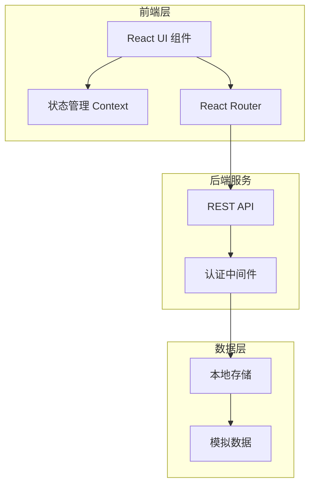
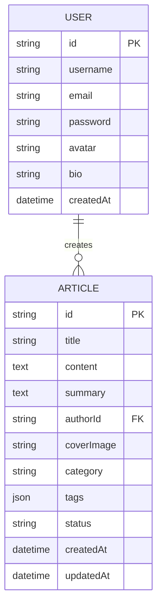

## 1. 架构设计



## 2. 技术说明

- **前端框架**: React 18 + TypeScript
- **样式方案**: Tailwind CSS 3
- **构建工具**: Vite
- **路由管理**: React Router v6
- **状态管理**: React Context API + useReducer
- **图标库**: Lucide React
- **富文本编辑器**: React Quill
- **后端服务**: 无后端，使用 LocalStorage 模拟数据持久化
- **数据存储**: LocalStorage + 内存模拟数据

## 3. 路由定义

| 路由路径 | 页面名称 | 功能描述 |
|---------|---------|---------|
| `/` | 首页 | 展示文章列表，导航入口 |
| `/login` | 登录页 | 用户登录表单 |
| `/register` | 注册页 | 用户注册表单 |
| `/create` | 文章创作页 | 创建新文章 |
| `/edit/:id` | 文章编辑页 | 编辑已有文章 |
| `/article/:id` | 文章详情页 | 查看文章详情 |
| `/profile` | 个人中心 | 用户信息和文章管理 |

## 4. API 定义（模拟）

### 4.1 用户相关

```typescript
// 用户数据类型
interface User {
  id: string;
  username: string;
  email: string;
  password: string; // 实际项目中应加密存储
  avatar?: string;
  bio?: string;
  createdAt: Date;
}

// 登录请求
interface LoginRequest {
  email: string;
  password: string;
}

// 注册请求
interface RegisterRequest {
  username: string;
  email: string;
  password: string;
}

// 用户响应
interface UserResponse {
  id: string;
  username: string;
  email: string;
  avatar?: string;
  bio?: string;
}
```

### 4.2 文章相关

```typescript
// 文章数据类型
interface Article {
  id: string;
  title: string;
  content: string;
  summary: string;
  authorId: string;
  author: UserResponse;
  coverImage?: string;
  category: string;
  tags: string[];
  status: 'draft' | 'published';
  createdAt: Date;
  updatedAt: Date;
}

// 创建文章请求
interface CreateArticleRequest {
  title: string;
  content: string;
  summary: string;
  coverImage?: string;
  category: string;
  tags: string[];
  status: 'draft' | 'published';
}

// 文章列表响应
interface ArticleListResponse {
  articles: Article[];
  total: number;
  page: number;
  pageSize: number;
}
```

## 5. 数据模型

### 5.1 数据模型定义



### 5.2 数据存储结构

```typescript
// LocalStorage 键名
const STORAGE_KEYS = {
  USERS: 'blog_users',
  CURRENT_USER: 'blog_current_user',
  ARTICLES: 'blog_articles',
};

// 初始模拟数据
const initialUsers: User[] = [
  {
    id: '1',
    username: 'demo',
    email: 'demo@example.com',
    password: 'demo123',
    avatar: 'https://api.dicebear.com/7.x/avataaars/svg?seed=demo',
    bio: '这是一个演示账号',
    createdAt: new Date('2024-01-01'),
  },
];

const initialArticles: Article[] = [
  {
    id: '1',
    title: '欢迎来到创作平台',
    content: '<p>这是一个支持文章创作的平台...</p>',
    summary: '欢迎来到这个全新的创作平台，开始你的写作之旅。',
    authorId: '1',
    author: initialUsers[0],
    category: '公告',
    tags: ['欢迎', '平台'],
    status: 'published',
    createdAt: new Date('2024-01-01'),
    updatedAt: new Date('2024-01-01'),
  },
];
```

## 6. 状态管理设计

### 6.1 认证状态

```typescript
interface AuthState {
  user: UserResponse | null;
  isAuthenticated: boolean;
  loading: boolean;
  error: string | null;
}

type AuthAction =
  | { type: 'LOGIN_START' }
  | { type: 'LOGIN_SUCCESS'; payload: UserResponse }
  | { type: 'LOGIN_FAILURE'; payload: string }
  | { type: 'LOGOUT' }
  | { type: 'REGISTER_START' }
  | { type: 'REGISTER_SUCCESS'; payload: UserResponse }
  | { type: 'REGISTER_FAILURE'; payload: string };
```

### 6.2 文章状态

```typescript
interface ArticleState {
  articles: Article[];
  currentArticle: Article | null;
  loading: boolean;
  error: string | null;
}

type ArticleAction =
  | { type: 'FETCH_ARTICLES_START' }
  | { type: 'FETCH_ARTICLES_SUCCESS'; payload: Article[] }
  | { type: 'FETCH_ARTICLES_FAILURE'; payload: string }
  | { type: 'CREATE_ARTICLE'; payload: Article }
  | { type: 'UPDATE_ARTICLE'; payload: Article }
  | { type: 'DELETE_ARTICLE'; payload: string };
```

## 7. 组件架构

```
src/
├── components/          # 可复用组件
│   ├── Layout/
│   │   ├── Header.tsx
│   │   ├── Footer.tsx
│   │   └── Layout.tsx
│   ├── Article/
│   │   ├── ArticleCard.tsx
│   │   ├── ArticleEditor.tsx
│   │   └── ArticleList.tsx
│   ├── Auth/
│   │   ├── LoginForm.tsx
│   │   └── RegisterForm.tsx
│   └── common/
│       ├── Button.tsx
│       ├── Input.tsx
│       └── Modal.tsx
├── pages/              # 页面组件
│   ├── Home.tsx
│   ├── Login.tsx
│   ├── Register.tsx
│   ├── CreateArticle.tsx
│   ├── EditArticle.tsx
│   ├── ArticleDetail.tsx
│   └── Profile.tsx
├── contexts/           # Context providers
│   ├── AuthContext.tsx
│   └── ArticleContext.tsx
├── hooks/              # 自定义 hooks
│   ├── useAuth.ts
│   └── useArticles.ts
├── services/           # 数据服务
│   ├── authService.ts
│   └── articleService.ts
├── types/              # TypeScript 类型定义
│   ├── user.ts
│   └── article.ts
├── utils/              # 工具函数
│   ├── storage.ts
│   └── helpers.ts
└── data/               # 模拟数据
    └── mockData.ts
```